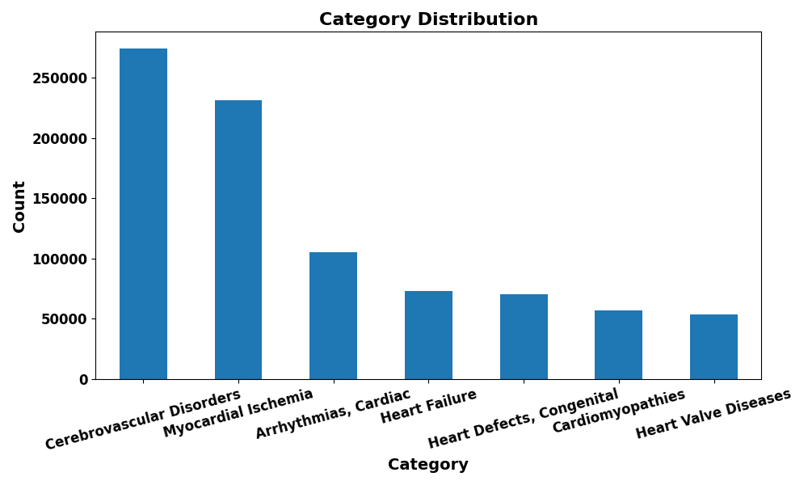
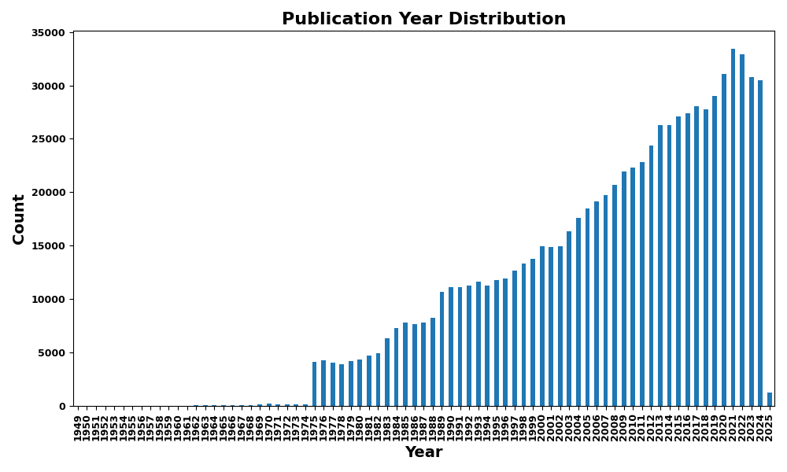
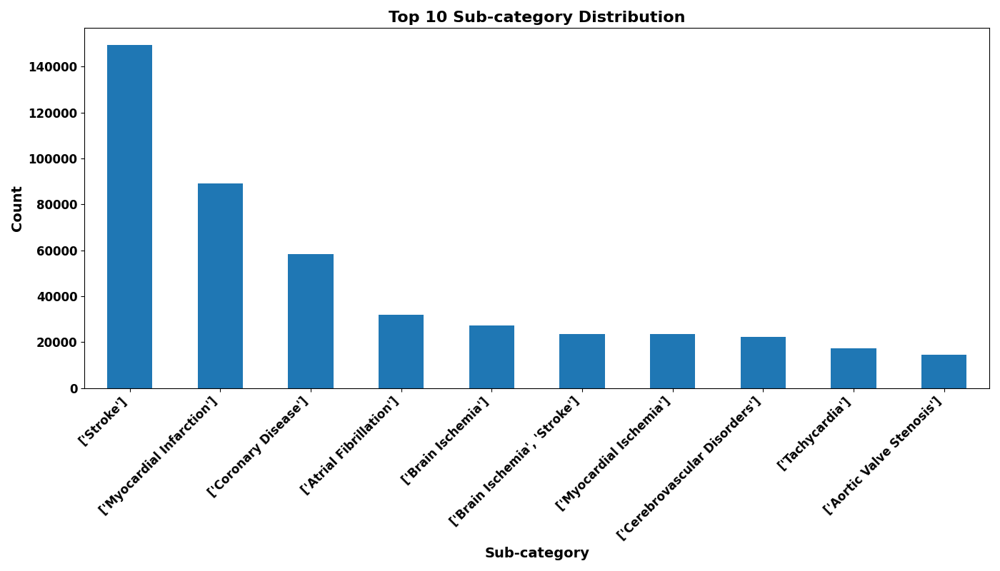

# Insta Learn

## 1 Dataset Collection
### 1.1 Name: PubMed25 Cardio
### 1.2 Cardio Mesh Descriptors (Parents)
- Cerebrovascular Disorders
- Myocardial Ischemia
- Cardiomyopathies
- Arrhythmias, Cardiac
- Heart Valve Diseases
- Heart Defects, Congenital

We thank [Prof. David Liem](https://physicians.ucdavis.edu/details/73579/david-liem-cardiovascular_medicine-sacramento) for creating and providing the mesh descriptors tree for Cardiovascular Diseases.

### 1.3 Curation Process
- We downloaded raw xml files from [pubmed25](https://ftp.ncbi.nlm.nih.gov/pubmed/baseline/)
- Total files: 1274 (filename example: pubmed25n0001.xml)
- Total Articles: 38,202,567 (38M)
- We filter articles with abstracts that has matching MeSH Descriptions with Cardio Mesh Descriptors mentioned above

### 1.4 PubMed 25 Cardio Analytics 
- Total Cardio Related Articles: 864244
- Top Journal: The American journal of cardiology (19779 articles)
- More details are covered in the [pubmed25_cardio_analytics](data/pubmed25_cardio_analytics.txt)

    
Category Distribution

    

    
Publication Date Year Distribution

    

    
Top 10 Journals

    

    
Top 10 Sub-Category Distribution

    

